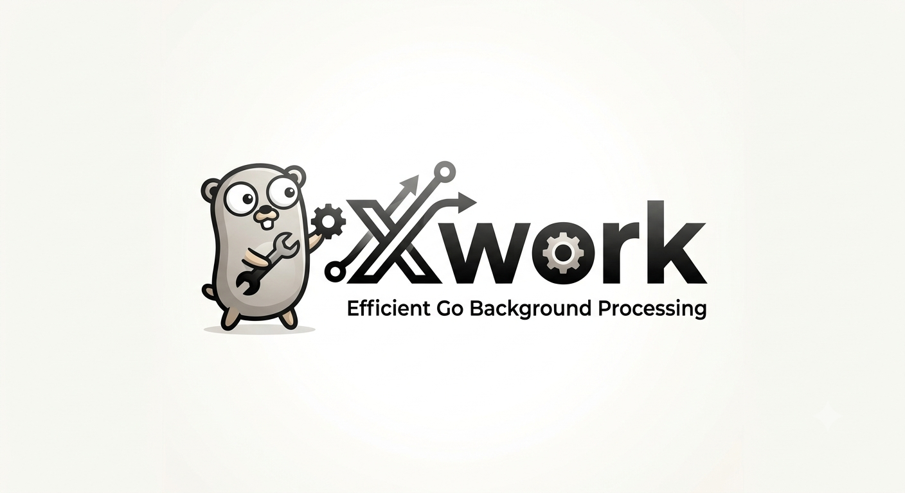

<div style="display: flex; flex-direction: row; justify-content: center; align-items: center">
    
</div>

# xwork

Minimal background jobs for Go.

xwork gives you a `Processor`, named jobs, queues, scheduled enqueueing, retries, heartbeats, graceful shutdown, and SQL or in-memory storage adapters.

## Install

```sh
go get github.com/mathiashsteffensen/xwork/v2
```

Use Go 1.26 or newer.

## Quick Start

```go
package main

import (
	"database/sql"
	"log"
	"time"

	"github.com/mathiashsteffensen/xwork/v2"
	"github.com/mathiashsteffensen/xwork/v2/storage"
	_ "github.com/mattn/go-sqlite3"
)

func main() {
	db, err := sql.Open("sqlite3", "./jobs.db?_busy_timeout=5000&_journal_mode=WAL")
	if err != nil {
		log.Fatal(err)
	}

	processor, err := xwork.NewProcessor(storage.NewSQL(db))
	if err != nil {
		log.Fatal(err)
	}

	sendWelcomeEmail := processor.DefineJob("default", "send_welcome_email", func(job *xwork.Job) error {
		userID, _ := job.Payload["user_id"].(string)

		log.Printf("send welcome email to user %s", userID)
		return nil
	})

	err = sendWelcomeEmail.Enqueue(xwork.JobPayload{
		"user_id": "user_123",
	})
	if err != nil {
		log.Fatal(err)
	}

	processor.Process()
}
```

`Process` blocks until the process receives a shutdown signal. On shutdown, xwork lets running jobs finish for the configured kill timeout and requeues interrupted jobs.

## Usage

### Create a Processor

xwork is storage-backed. The bundled SQL adapter accepts any `*sql.DB` and creates the xwork tables during `NewProcessor`.

```go
db, err := sql.Open("sqlite3", "./jobs.db?_busy_timeout=5000&_journal_mode=WAL")
if err != nil {
	log.Fatal(err)
}

processor, err := xwork.NewProcessor(storage.NewSQL(db))
if err != nil {
	log.Fatal(err)
}
```

You can tune concurrency, shutdown time, and logging before starting work:

```go
processor.SetConcurrency(10)
processor.SetKillTimeout(30 * time.Second)
processor.SetLogger(logger)
```

Default concurrency is `5`. Default kill timeout is `15s`.

### Define Jobs

A job has a queue, a name, and a handler.

```go
resizeImage := processor.DefineJob("media", "resize_image", func(job *xwork.Job) error {
	imageID, _ := job.Payload["image_id"].(string)
	size, _ := job.Payload["size"].(string)

	return resize(imageID, size)
})
```

Handlers receive a `*xwork.Job`, also exported as `*xwork.ProcessingJob`. Return `nil` when the job succeeds. Return an error to fail the attempt and schedule a retry.

### Bind Payloads

Use `Bind` when you want a typed payload instead of reading values from `JobPayload` directly.

```go
type ResizeImagePayload struct {
	ImageID string `json:"image_id"`
	Size    string `json:"size"`
}

resizeImage := processor.DefineJob("media", "resize_image", func(job *xwork.Job) error {
	payload, err := xwork.Bind[ResizeImagePayload](&job.Payload)
	if err != nil {
		return err
	}

	return resize(payload.ImageID, payload.Size)
})
```

`Bind` converts through JSON, so it honors struct `json` tags. Return the error from the handler to fail the attempt and use the normal retry flow when the payload cannot be bound.

### Enqueue Jobs

Use the returned job definition when the producer and consumer share setup code:

```go
err := resizeImage.Enqueue(xwork.JobPayload{
	"image_id": "img_123",
	"size":     "1024x1024",
})
```

Or enqueue by name through the processor:

```go
err := processor.Enqueue("resize_image", xwork.JobPayload{
	"image_id": "img_456",
	"size":     "300x300",
})
```

`Enqueue` fails if no job with that name has been defined.

### Schedule Jobs

Use `EnqueueIn` for relative delays:

```go
err := sendReminder.EnqueueIn(24*time.Hour, xwork.JobPayload{
	"user_id": "user_123",
})
```

Use `EnqueueAt` for absolute times:

```go
err := processor.EnqueueAt("send_report", time.Date(2026, 7, 1, 9, 0, 0, 0, time.UTC), xwork.JobPayload{
	"account_id": "acct_123",
})
```

Scheduled jobs are stored first, then moved to their queue when ready.

### Process Queues

With no arguments, `Process` listens to every queue used by defined jobs:

```go
processor.Process()
```

You can restrict a worker process to selected queues:

```go
processor.Process("critical", "default")
```

That makes it easy to run separate worker pools:

```sh
# terminal 1
worker critical

# terminal 2
worker default media
```

Then pass the CLI queue names into `Process`.

### Retries and Failures

If a handler returns an error or panics, xwork records the job as failed and retries it later.

```go
chargeCard := processor.DefineJob("billing", "charge_card", func(job *xwork.Job) error {
	paymentID, _ := job.Payload["payment_id"].(string)

	if err := charge(paymentID); err != nil {
		return err
	}

	return nil
})
```

Retries use cubic backoff: retry `1` waits `1m`, retry `2` waits `8m`, retry `3` waits `27m`, and so on. xwork retries up to `19` times after the first failed attempt.

Processing jobs emit heartbeats. If a worker disappears, stale processing jobs are treated as orphaned failures and enter the retry flow.

### Inspect Jobs

The storage adapter can list and count jobs by state. This is useful for CLIs, admin commands, tests, and operational checks.

```go
storageAdapter := storage.NewSQL(db)

queued, err := storageAdapter.ListEnqueued("default", 50, 0)
if err != nil {
	log.Fatal(err)
}

for _, job := range queued {
	log.Printf("%s %s retry=%d", job.ID, job.Name, job.RetryCount)
}
```

Count jobs by state:

```go
failedCount, err := storageAdapter.Count(xwork.JobTypeFailed)
if err != nil {
	log.Fatal(err)
}

log.Printf("failed jobs: %d", failedCount)
```

Available states are scheduled, enqueued, processing, processed, and failed.

### Split Producers and Workers

Producers still need to define the job before enqueueing by name, because definitions map names to queues.

```go
func registerJobs(processor *xwork.Processor) {
	processor.DefineJob("emails", "send_receipt", sendReceipt)
	processor.DefineJob("billing", "charge_card", chargeCard)
}
```

Use the same registration from your application process, CLI, and workers:

```go
processor, err := xwork.NewProcessor(storage.NewSQL(db))
if err != nil {
	log.Fatal(err)
}

registerJobs(processor)

err = processor.Enqueue("send_receipt", xwork.JobPayload{
	"order_id": "order_123",
})
```

Worker:

```go
registerJobs(processor)
processor.Process("emails", "billing")
```

## Storage

The bundled persistent adapter is `storage.NewSQL(db)`. It implements `xwork.StorageAdapter` and uses these tables:

- `xwork_schedule`
- `xwork_queue`
- `xwork_processing`
- `xwork_processed`
- `xwork_failed`

For tests and local-only workers, use the in-memory adapter:

```go
processor, err := xwork.NewProcessor(storage.NewMemory())
```

Custom storage backends can implement `xwork.StorageAdapter`. If a backend also implements `Initialize() error`, xwork calls it from `NewProcessor`.
